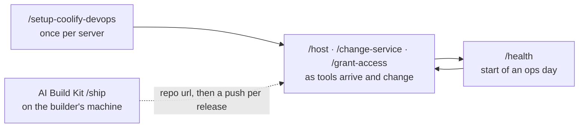

# coolify-devops

[](LICENSE)
[](https://skills.sh/KasperHonore/coolify-devops)
[](#install)

An installable set of commands for Claude Code that gives a small team a repeatable
way to run the tools it builds on its own server, without anyone becoming the
sysadmin.

You do not need to know Docker or read logs. You do need to say what should be
reachable by whom, look at the result in a browser, and make the exposure and access
decisions the agent cannot make for you. It is the hosting half of a pair:
[AI Build Kit](https://github.com/gwpicard/ai-build-kit) builds and checks a tool on
your machine; coolify-devops runs on the server and takes that tool to an address
the team can use.

## At a glance

| | |
|---|---|
| What it is | Commands you type into Claude Code on your server, and the hosting discipline behind them. |
| Who it is for | Someone who owns a server and a team's tools, and does not want to operate Docker by hand. |
| Works with | A server running [Coolify](https://coolify.io) 4.x on a [Tailscale](https://tailscale.com) tailnet, operated through the [Coolify MCP](https://github.com/StuMason/coolify-mcp). Claude Code through the plugin marketplace; Claude Code and other agents through the shared skills installer. |
| You need | Claude Code, Git, Node for `npx`, and a Coolify API token in your shell. |
| Install, Claude Code only | `claude plugin marketplace add KasperHonore/coolify-devops`, then `claude plugin install coolify-devops@coolify-devops --scope local` |
| Install, any supported agent | `npx skills add KasperHonore/coolify-devops` |
| Then type | `/coolify-devops:setup-coolify-devops` on the Claude plugin route, `/setup-coolify-devops` on every other route |
| How long setup takes | One interview, answered one question at a time, plus the steps only a human can do on the server, handed over and verified one by one. |
| Where it runs | On the Coolify host itself, in root's home directory, which becomes the deployment repo. |
| Licence | MIT |
| Cost | Free. You pay for the server and the coding agent subscription. |

## Install

Choose one installation route. Do not use more than one on the same server.

Either way, install **on the Coolify host, in root's home directory**. That is where
Coolify's own web terminal (Servers → Terminal) and Tailscale SSH both land, so there
is never anything to `cd` into, and the deployment repo the skills create *is* that
directory.

For a server operated only from the Claude Code terminal app, open a shell on the
host and run:

```bash
cd ~
claude plugin marketplace add KasperHonore/coolify-devops
claude plugin install coolify-devops@coolify-devops --scope local
```

Start Claude Code in that directory and type `/coolify-devops:setup-coolify-devops`.
Local scope keeps the plugin attached to this directory on this machine without
changing settings shared elsewhere.

For Codex, Cursor, Gemini CLI, another coding agent, or a server operated from more
than one agent, run this from the same directory:

```bash
cd ~
npx skills add KasperHonore/coolify-devops -a claude-code -y
```

Choose the agents you use and install all five skills. Then start the agent and type
`/setup-coolify-devops`, or ask: "Run the setup-coolify-devops skill."

Whichever route you choose, answer one question at a time. The agent asks where
Claude Code runs (on the host it reads the tailnet domain and IPs itself), where the
server runs, whether you will host public-facing apps (and if so the domain: your
own, or a free DuckDNS one), and who may reach the Coolify dashboard. It writes the
deployment repo, hands you the steps it cannot do (the VM, Tailscale, the Coolify
install, the cloud firewall), verifies each one, creates the projects, deploys the
tailnet registrar ([docktail](https://github.com/dgl/docktail)) and a canary service,
and accepts with `/health`.

The shared [skills installer](https://github.com/vercel-labs/skills) supports Claude
Code, Codex, Cursor, and Gemini CLI. It installs the skills inside the deployment
repo and records their source for later updates.

Do not install the skills globally or outside the deployment repo. On their own they
read `instance.yaml` and `docs/` and are useless. The five commands are the whole
interface.

## What this is

Coolify already makes deploying a container a few clicks. What it does not give a
small team is a way of working that survives the person who clicked: which of two
lanes a tool belongs in, one plain name used everywhere, the labels that put a tool
on the tailnet correctly the first time (some are write-once, and nothing warns you),
the firewall that actually enforces "internal", secrets that never land in a repo,
and a record of what was deployed and why.

The skills carry that discipline. Every tool goes down one of two lanes: **internal**,
reachable only over the tailnet at `https://<name>.<tailnet>.ts.net`, or **public**,
reachable on the internet at `https://<name>.<your-domain>` with TLS handled for you.
Internal is the default. Every operation goes through the Coolify MCP, so there is no
SSH, no `docker` command, and no file edited on the host, and the deployment repo is
the memory the next session reads.

## Commands

Command names say when to use them.

| When | Type | What it does |
|---|---|---|
| I have a fresh server | `/setup-coolify-devops` | Interview, deployment repo, human steps verified, projects, plumbing, canary. Once per server. |
| Put X on the tailnet, or make X public | `/host` | A git repo, an image, or a product name, to a verified address. |
| Something deployed needs changing | `/change-service` | Compose, env vars, and config-file mounts, including the changes that quietly do nothing. |
| How is everything? | `/health` | Status, reachability, the firewall, published ports, drift. Read-only. |
| Someone joins, leaves, or needs a tool | `/grant-access` | Who can reach which internal tool. People and policy only. |

You never choose the method: each command reads the deployment repo first, does its
work through the MCP, verifies with checks a green container does not answer, and
updates the repo before it finishes. `AGENTS.md` in the deployment repo is the
day-to-day rulebook every session reads.

## How hosting flows



You run `/setup-coolify-devops` once. After that you go in wherever you actually are:
a session is usually one `/host`, one `/change-service`, or `/health` before touching
anything, and none of them needs another to have run first.

The first `/host` of a tool is the heaviest, because it researches the upstream,
decides the lane and name with you, authors the deployment, and runs the tailnet
verification steps. Later releases of a tool built from a git repo are a push:
Coolify redeploys on its own.

A tool built with AI Build Kit arrives through its `/ship`, which decides *whether*
and *what* goes live. `/host` decides *where* and *how* it runs. The address is the
only thing that crosses, carried by a person between two sessions on two machines.

## Examples

A first session. You type `/setup-coolify-devops` in root's home on the host, and the
agent interviews you one question at a time, reading what it can from the machine
itself so you correct rather than dictate. It writes the deployment repo, hands you
the console steps for Tailscale and the cloud firewall, verifies each one when you
say it is done, creates the projects, deploys the registrar and a canary, and ends
with `/health` green.

A tool for the team. You type `/host` with a git repo URL. The agent asks one
question, internal or public, recommending internal. It researches the upstream,
picks the name, creates the application from the git source, deploys it, checks the
registrar's logs and the Tailscale control plane for the write-once port, and asks
you to open `https://<name>.<tailnet>.ts.net` in a browser. Then it writes the
reference copy and the inventory.

A tool that arrived from AI Build Kit. `/host` finds the hosting request its `/ship`
wrote into the masterplan, skips the research, deploys from the repo with per-PR
previews and push-to-deploy, and prints an address block for the builder to paste
back. Every later release is a push to `main`.

A config change. You type `/change-service` and say what should differ. The agent
knows that editing a config-file mount through the obvious path rewrites a database
row and never the file, runs the recreate sequence instead, and proves the change
took before it updates the reference copy.

A new colleague. You type `/grant-access` and name them and the tools. The agent
edits the tailnet policy, records the decision, and tells you what they can now open.

## Configuration

| What you can change | Where |
|---|---|
| Rules for your server that the agent must follow | `AGENTS.md` in the deployment repo, rendered from `instance.yaml`. Re-render after a change. |
| Domains, project names, the canary, policy defaults | `instance.yaml`. Skills name its keys instead of hardcoding values. |
| Keys and tokens | Your shell environment, from a root-only env file in your home. The Coolify MCP reads them; the repo never holds them. Per-tool secrets live in Coolify's env store. |
| Who can reach which internal tool | The tailnet policy, through `/grant-access`, with the decisions recorded in `docs/tailnet-state.md`. |
| Who may reach the Coolify dashboard | The `exposure.coolify_ui` binding, and the cloud firewall rules `docs/provisioning.md` renders from it. |

Treat installed skill folders as managed packages, and update them with the route
that installed them rather than by editing them.

## The three records

Three records hold the server's memory: `instance.yaml` is the bindings, `docs/`
holds the runbooks rendered for your instance plus the two state files
(`infrastructure.md`, what is deployed and where; `tailnet-state.md`, who can reach
what), and `stacks/` holds a reference copy of every deployed resource with a README
where the wiring is not obvious. `AGENTS.md` sits alongside them, holding the
standing rules for the repository itself. Coolify's database is the write path; the
records describe it and are never applied.

## Which lane will it be on?

| Situation | Lane |
|---|---|
| A tool for your own team: a tracker, a dashboard, a database UI, an LLM gateway | Internal |
| Anything you are unsure about | Internal |
| A tool that receives third-party webhooks, serves an OAuth callback, or has users outside the team | Public |
| Platform plumbing that makes the lanes work | Neither: the Infrastructure project, not user-facing |

The lane is asked for on every `/host`, never assumed, because it decides who can
reach the thing. The public lane exists only when the instance has a domain, and the
cloud firewall outside the VM is what makes "internal" true.

## What the kit does to reduce risk

The kit assumes the person directing the work will not read logs or open a shell, so
every protection is mechanical or written down. The MCP is the only way in: the skills
never assume SSH, never run `docker`, and never edit files on the host. `/health`
never mutates anything, and starts every ops day.

"Internal" is enforced, not declared. Docker's own port publishing walks straight past
`ufw`, so the skills never publish a host port and the cloud firewall in front of the
host is what guarantees the lanes. `/setup-coolify-devops` creates that firewall when
it has a provider token and `/health` reads its rules back; a firewall that was
skipped is recorded as a known gap and 2FA on the dashboard is insisted on.

A green deploy proves nothing. Internal tools are verified four ways: the registrar's
logs, the Tailscale control plane's own definition of the service (the one place a
write-once port mistake is visible), the device approval, and a person in a browser.
Public ones are curled from the open internet.

Two simpler protections sit underneath. Secrets are never printed into a session and
never stored in the repo: the MCP token comes from the shell, and per-tool secrets
live in Coolify's env store, listed masked. And nothing goes live without a person
between "ready" and "live": the builder's `/ship` and the server's `/host` are two
sessions on two machines by design.

## How it compares

| | Where it runs | What you type | What you get |
|---|---|---|---|
| Coolify's dashboard | your browser | clicks | Deploys anything in minutes. Remembers nothing about why, and cannot tell you the tailnet label you set is write-once. |
| Terraform for Coolify | your machine | HCL | Declarative state for a provider that lags the API. `docs/iac.md` records why it was evaluated and not adopted. |
| Dokku, Kamal, Coolify's CLI | your terminal | commands | A developer's deploy tool. Assumes you read logs and know Docker. |
| AI Build Kit | the project repo | `/ship` | Decides when a tool is ready to rely on. Does not host it. |
| coolify-devops | the server | `/host`, `/change-service`, `/health`, `/grant-access` | The hosting discipline carried for you, with the deployment repo as the record. |

## FAQ

**Do I need to know Docker?**
No. The five commands are the whole interface, and the kit is built on the
assumption that you will not open a shell on the server. You do have to decide
internal or public, look at the result in a browser, and say who may reach what.

**How does it fit with AI Build Kit?**
AI Build Kit builds and checks a tool in the project repo on your machine, and its
`/ship` is the only command there that takes work live. coolify-devops runs on the
server and is where that copy runs. `/ship` decides whether and what goes live;
`/host` decides where and how it runs. `/ship` writes a hosting request into the
masterplan, you run `/host` on the server, and `/host` hands back an address block to
paste into the masterplan. After that, a release is a push.

**Do I have to use AI Build Kit?**
No. `/host` takes any git repo, Docker image, or product name. A repo built without
the kit gets the full research pass instead of the hosting request.

**Where does it run?**
On the Coolify host itself, in root's home directory, which becomes the deployment
repo. Its `.gitignore` is an allow-list, so a home directory full of dotfiles, the
token file, and shell history is safe as a git repo: none of that is ever tracked.

**Can I run it from my laptop instead?**
Yes, from a machine on the same tailnet. Setup asks where Claude Code runs and
adjusts: the firewall probe becomes real, and the Tailscale CLI over Tailscale SSH is
the one sanctioned exception to "no SSH". On the host is the usual and simpler case.

**Which coding agents does this work with?**
Claude Code through the plugin marketplace, and Claude Code, Codex, Cursor, and
Gemini CLI through the shared skills installer. The skills need the Coolify MCP
configured for the agent, which setup does through `.mcp.json`.

**Can I add it to a server that already has things deployed?**
Yes. Setup looks for existing plumbing before deploying its own and puts adopt,
upgrade, or replace to you with evidence. Resources already deployed are inventoried
by `/health` and get a reference copy when you next touch them.

**Does anything leave my server?**
Nothing about your server is in this repository, and the deployment repo has no push
remote. Public DNS records and the tailnet registration are the two things that go
out, both through the plumbing setup deploys, and both explained first.

**What does it cost?**
The kit is free. Running with it needs a server, Tailscale (free for small teams),
a domain if you host publicly (DuckDNS is free), and an agent subscription.

**Is this right for my server?**
It is strongest for a single Coolify server hosting a team's own tools, mostly
internal. It assumes Coolify 4.x, docktail as the tailnet registrar, Traefik as the
public proxy, and Cloudflare or DuckDNS for public DNS. Swapping any of those
invalidates whole runbook sections, not just bindings.

**How is this different from just using Coolify?**
Coolify is the write path; every deploy still happens in it. What the kit adds is
the lane model, the naming rule, the tailnet plumbing and its verification, the
firewall that enforces it, and a repo that remembers why.

## What it does not promise

The kit is free software, provided as is, under the [MIT licence](LICENSE). There is
no warranty, and the licence's own terms are the ones that apply.

The skills verify what they can reach from the server. A browser check over the
tailnet is still a person's job, and a firewall that was skipped is a recorded gap,
not a solved one. A green `/health` means the checks it runs passed, which is a
smaller claim than the server being secure.

The MCP is the only way in. Anything the MCP cannot do, the skills will say cannot be
done from here, rather than reach for a shell. Some Coolify behaviour is known only
from sessions that learned it the hard way; the runbooks say which facts are
measured and which are still assumed.

You own the exposure decisions. The kit recommends internal and asks every time; it
does not decide for you whether a tool belongs on the internet, and it does not carry
the consequences when it does.

It is not a substitute for a professional operator, and it is not security advice.

## Contributing

Problems and suggestions belong in the
[public issue tracker](https://github.com/KasperHonore/coolify-devops/issues).
Lessons a session learned the hard way belong in the skill that should have prevented
them, in the same change as the fix.

## For technical people

The public repository is an Agent Skills source and a Claude Code plugin marketplace.
Each folder under `skills/` is one skill with everything it needs, and both routes
carry the same five. `.claude-plugin/plugin.json` lists them for the plugin route,
where the commands use the `coolify-devops:` prefix; `skills.sh.json` groups them for
the shared installer, which records the source in `skills-lock.json`.

The skills operate a **deployment repo**, which `/setup-coolify-devops` creates *in
place*, in the working directory. Only these files are ever tracked:

| Path | What it is |
|---|---|
| `AGENTS.md` | The operating rules every agent session reads: lanes, naming, the write path, the traps. Rendered |
| `CLAUDE.md` | One line, `@AGENTS.md`, so Claude Code imports the same rules; other agents read `AGENTS.md` directly |
| `instance.yaml` | Your bindings; skills name its keys instead of hardcoding values |
| `docs/` | Runbooks rendered for your instance (`provisioning.md`, `platform.md`, `internal-services.md`, `tailnet-access.md`, `changing-a-resource.md`) plus the two hand-maintained state files |
| `stacks/` | Reference copies of what is deployed. Coolify is the write path; nothing here is applied |
| `.mcp.json` | `npx @masonator/coolify-mcp@latest` with `${COOLIFY_BASE_URL}` / `${COOLIFY_ACCESS_TOKEN}` from your shell |

The rendered files come from templates bundled *inside* the setup skill
(`skills/setup-coolify-devops/assets/`, rendered by
`skills/setup-coolify-devops/scripts/scaffold.js`). That is deliberate: both install
routes deliver only skill directories, so the runbooks travel with the skill and
update with it. The scaffolder finds the deployment repo from its own path when
installed as files, and falls back to the working directory when it runs from the
plugin cache; it never creates a nested folder and never writes into the cache.

Updating, plugin route:

```bash
claude plugin marketplace update coolify-devops
claude plugin update coolify-devops@coolify-devops --scope local
```

then type `/coolify-devops:setup-coolify-devops`, which in an existing repo only
re-renders. Skills CLI route:

```bash
npx skills update
node .claude/skills/setup-coolify-devops/scripts/scaffold.js --render
```

`npx skills update` refreshes the skills already installed; a skill that was
*renamed* upstream shows as "deleted upstream" and its new name is not picked up. Run
`npx skills add KasperHonore/coolify-devops -a claude-code -y` again to get it, and
`npx skills remove <old-name> -y` for the stale copy. The state files and `stacks/`
are yours and are never touched by a render.

Each skill's frontmatter carries `license`, `compatibility` (what it needs from its
environment) and `metadata.version`, which equals the package version. Each version
has a `v<version>` tag and a GitHub release whose notes are its `CHANGELOG.md` entry,
with an [Agent Skills](https://agentskills.io) discovery index and one artifact per
skill attached. A version is never re-released with different skill content.

This repository is the `library/` subtree of the author's own deployment repo, which
consumes it exactly as a consumer does, so what every consumer receives and what the
author runs on cannot drift. `npm run check` is what CI and the publish script run:
the scaffolder smoke test, the Agent Skills reference validator over each skill, the
version sync, and a discovery-index build. `AGENTS.md` is the contributor guide, for
agents and people alike. Design notes and the record of decisions:
`skills/setup-coolify-devops/assets/docs/skill-library.md`.
